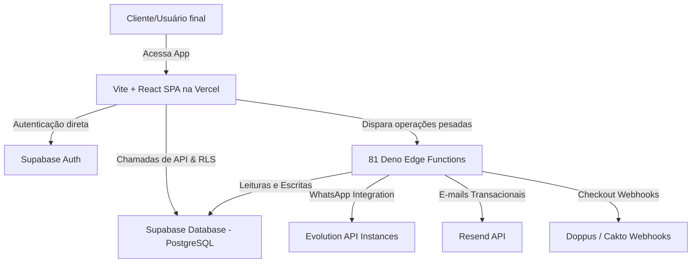
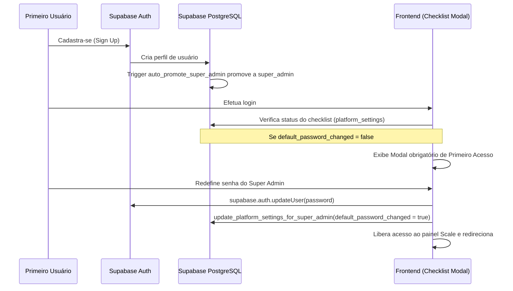
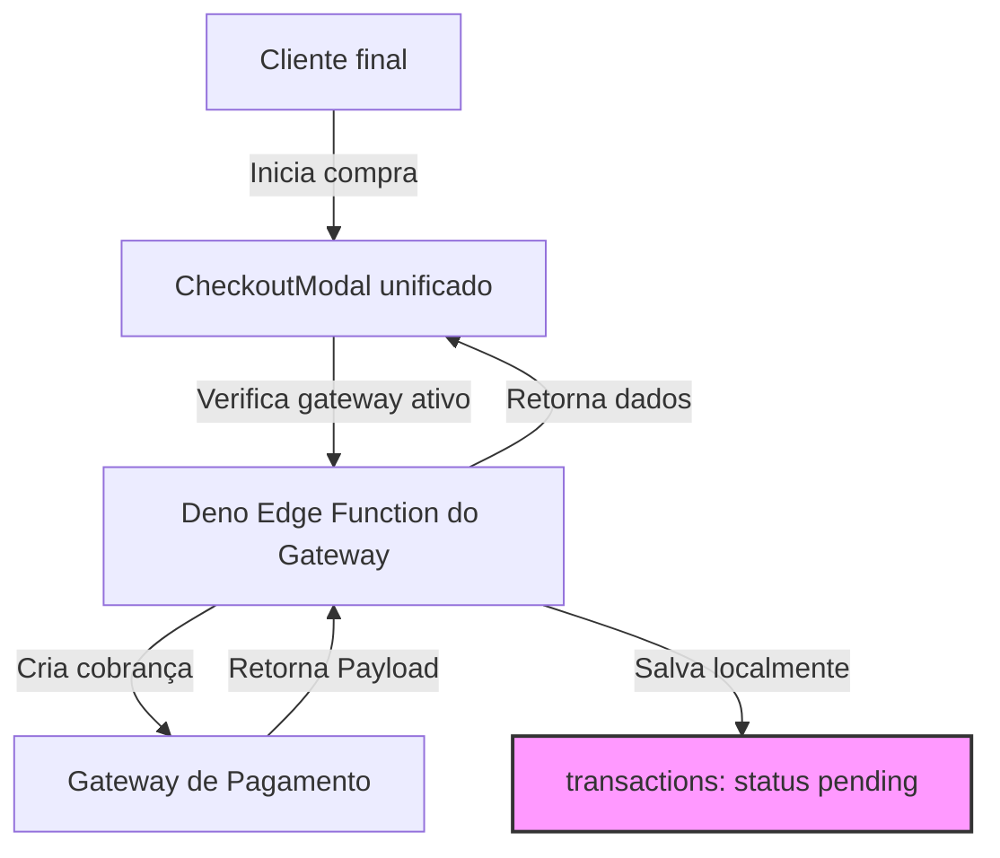

# 📖 Documentação Geral do Projeto — Scale (White Label)

Bem-vindo à documentação oficial do **Scale** (anteriormente *Vendus*). Este documento descreve em detalhes a arquitetura técnica, modelo de banco de dados, fluxo de autenticação e primeiro acesso do Super Admin, sistema de segurança RLS (Row Level Security), ecossistema de Edge Functions e as diretrizes de implantação do projeto.

---

## 🗺️ 1. Arquitetura Geral do Sistema

O Scale foi projetado sob uma arquitetura **Multi-Tenant nativa e isolada** no nível de banco de dados, usando as melhores práticas de computação na nuvem com **React (Frontend)** e **Supabase (Backend/Database/Serverless)**.



### Componentes Principais:
1. **Frontend (SPA)**: Aplicação React compilada com Vite, estilizada com Tailwind CSS e shadcn/ui. Hospedada na Vercel e configurada para redirecionar todas as rotas virtuais internas para o `index.html` através de regras de rewrite no `vercel.json`.
2. **Backend Serverless (Supabase + Edge Functions)**: O banco de dados PostgreSQL gerencia os dados estruturados de forma segura através de políticas de **Row Level Security (RLS)**. As lógicas que exigem integrações com terceiros ou privilégios de administrador rodam em **Deno Edge Functions** hospedadas no próprio Supabase.
3. **Isolamento de Dados (RLS)**: Toda tabela de dados de clientes possui um campo `organization_id` vinculado à tabela `organizations`. As políticas de RLS garantem que usuários de uma empresa não tenham qualquer visibilidade ou capacidade de escrita em dados de outras empresas.

---

## 🗄️ 2. Estrutura do Banco de Dados & Principais Entidades

O banco de dados conta com **139 tabelas públicas**, organizadas de forma lógica em módulos interdependentes. 

> [!NOTE]
> Para uma visualização detalhada de todas as 139 tabelas e suas 2031 colunas, consulte o [DATABASE.md](file:///c:/Users/Usúario%20x/Downloads/Nova%20pasta%20(2)/vendus-v3-main/docs/DATABASE.md).

### Entidades Críticas da Arquitetura:

| Entidade | Descrição | Relacionamentos Chave |
| :--- | :--- | :--- |
| `organizations` | Representa as empresas clientes (tenants). Armazena dados de assinatura, limites e configurações de White Label específicas daquela revenda. | Relaciona-se com `profiles`, `leads`, `webhooks`, etc. |
| `profiles` | Contém as informações de perfil dos usuários. O `id` é idêntico ao `uid` do usuário em `auth.users` do Supabase. | Herda `organization_id`. |
| `user_roles` | Tabela isolada por questões de segurança para atribuição de cargos (`app_role` enum: `super_admin`, `admin`, `manager`, `seller`). | Chave primária composta por `user_id` e `role`. |
| `platform_settings` | Tabela global de configuração do sistema (configurações do Super Admin). Guarda variáveis do rebranding visual do Scale, tema padrão, credenciais da Evolution API e status do checklist de primeiro acesso. | Registros limitados a 1 (singleton). |

---

## 🔐 3. Segurança & Row Level Security (RLS)

O Scale utiliza **RLS rigoroso** em 100% de suas tabelas.

### A Função `has_role`
A base de toda a segurança é a função PL/pgSQL `public.has_role(user_id, app_role)`, que atua sob permissões de `SECURITY DEFINER` para ler a tabela de privilégios `user_roles` contornando a RLS restrita daquela tabela:
```sql
CREATE OR REPLACE FUNCTION public.has_role(user_id uuid, role public.app_role)
RETURNS boolean AS $$
BEGIN
  RETURN EXISTS (
    SELECT 1 FROM public.user_roles 
    WHERE user_roles.user_id = has_role.user_id 
      AND user_roles.role = has_role.role
  );
END;
$$ LANGUAGE plpgsql SECURITY DEFINER;
```

### O Desafio de RLS com Colunas Restritas (Primeiro Acesso)
No Supabase, políticas de RLS normais aplicam-se a linhas inteiras (`SELECT`, `INSERT`, `UPDATE`). No entanto, privilégios de escrita ou leitura em tabelas sensíveis como `platform_settings` exigem regras adicionais. Tentativas diretas de ler colunas restritas sob usuários comuns retornam erros silenciosos ou nulos.

#### RPCs Seguras de Super Admin
Para contornar isso de forma segura, implementamos funções de banco de dados encapsuladas como `SECURITY DEFINER` na migration [20260517000007_fix_super_admin_first_access_rls.sql](file:///c:/Users/Usúario%20x/Downloads/Nova%20pasta%20(2)/vendus-v3-main/supabase/migrations/20260517000007_fix_super_admin_first_access_rls.sql):
- `get_platform_settings_for_super_admin()`: Lê as configurações do Super Admin de forma privilegiada no banco, mas valida rigidamente no servidor se o usuário atual é de fato um `super_admin`.
- `update_platform_settings_for_super_admin(settings jsonb)`: Grava e atualiza as configurações visuais e do sistema no servidor, garantindo conformidade e eliminando o erro de permissão negada no frontend.

---

## 🔑 4. Fluxo de Primeiro Acesso & Bootstrapping do Super Admin

Ao implantar a plataforma em um banco de dados novo, o primeiro usuário a se registrar precisa ser promovido a **Super Admin** para conseguir gerenciar o sistema.



### Gatilhos e Automações de Promoção:
1. **Trigger `auto-promote-super-admin` / Edge Function `bootstrap-super-admin`**: Responsável por monitorar novos registros. Se a tabela `user_roles` estiver vazia, o primeiro usuário a se registrar é automaticamente promovido ao cargo de `super_admin` e sua organização marcada como controladora da plataforma.
2. **Flag de Forçar Troca de Senha**: No login do Super Admin, a plataforma consulta se `platform_settings.default_password_changed` é `false`. Se sim, o modal de configuração de primeiro acesso é travado na tela do usuário. Uma vez alterada a senha e salva com sucesso usando a RPC do Super Admin, o fluxo é liberado de forma definitiva e o cache do React Query é invalidado.

---

## 👥 5. Fluxo de Autenticação Social Google OAuth

No projeto original, a autenticação social com o Google era intermediada por um proxy de desenvolvimento gerenciado pelo Lovable (`@lovable.dev/cloud-auth-js`), fazendo chamadas para a rota `~oauth/initiate`.
Como a plataforma foi migrada para um domínio próprio (`scale.glauberads.com.br`) e banco de dados próprio, essa infraestrutura de terceiros causava erros de `404 NOT_FOUND`.

### Nova Abordagem (Autenticação Nativa de Ponta a Ponta):
No arquivo [Login.tsx](file:///c:/Users/Usúario%20x/Downloads/Nova%20pasta%20(2)/vendus-v3-main/src/pages/Login.tsx), substituímos a biblioteca do Lovable pela API direta do próprio Supabase client:
```typescript
const { error } = await supabase.auth.signInWithOAuth({
  provider: 'google',
  options: {
    redirectTo: window.location.origin, // Redireciona de volta para scale.glauberads.com.br
  },
});
```

> [!WARNING]
> **Configurações obrigatórias no painel do Supabase**:
> Para que o fluxo acima complete com êxito:
> 1. Acesse o console do **Supabase** ➔ **Authentication** ➔ **URL Configuration**.
> 2. Certifique-se de preencher a URL do seu site de produção (`https://scale.glauberads.com.br`) em **Site URL** e na lista de **Redirect URLs**.
> 3. Em **Providers** ➔ **Google**, ative o provedor e insira o Client ID e Client Secret obtidos no seu Google Cloud Console configurado para o respectivo domínio.

---

## ⚡ 6. Ecossistema de Edge Functions (81 Funções Deno)

O backend do Scale possui **81 Edge Functions** independentes desenvolvidas em TypeScript rodando sobre Deno.

> [!NOTE]
> Para obter a lista exata e a utilidade de cada uma das 81 funções, leia o [EDGE_FUNCTIONS.md](file:///c:/Users/Usúario%20x/Downloads/Nova%20pasta%20(2)/vendus-v3-main/docs/EDGE_FUNCTIONS.md).

### Grupos de Destaque:
1. **WhatsApp & Omnichannel**:
   - `evolution-webhook`: Responsável por receber mensagens de áudio, imagem e texto das instâncias de WhatsApp no servidor da Evolution API e gravar no banco de dados.
   - `transcribe-audio`: Captura mensagens de áudio enviadas no WhatsApp e as transcreve de forma síncrona usando o ElevenLabs Scribe v2.
2. **IA & Cérebro Comercial**:
   - `sales-copilot`: Processa a IA multimodal (com suporte a chat e voz) para vendedores no CRM.
   - `ai-followup-cron`: Função agendada via cron do Supabase que varre leads qualificados e envia mensagens automáticas baseadas em cadência visual, respeitando estritamente o horário comercial (`business_hours`).
3. **Webhooks e Pagamentos**:
   - `doppus-webhook` / `cakto-webhook` / `hotmart-webhook`: Processadores de pós-venda, aprovações de checkout e automação de tags do lead para ativar liberação de acessos.

---

## 🌐 7. Deploy & Roteamento na Vercel

O frontend do Scale é um **SPA (Single Page Application)**. Em SPAs hospedadas em plataformas de arquivos estáticos como a Vercel, acessar rotas internas diretamente pelo navegador (ex: `https://scale.glauberads.com.br/super-admin`) ou atualizar a página pressionando F5 gera erros de `404 NOT_FOUND` porque o servidor tenta buscar uma pasta ou arquivo físico naquele endereço.

### Solução de Roteamento SPA
Criamos o arquivo [vercel.json](file:///c:/Users/Usúario%20x/Downloads/Nova%20pasta%20(2)/vendus-v3-main/vercel.json) na raiz do workspace. Este arquivo instrui o servidor de borda da Vercel a realizar um rewrite interno de todas as requisições não-físicas diretamente para o nosso ponto de entrada principal:
```json
{
  "rewrites": [
    {
      "source": "/(.*)",
      "destination": "/index.html"
    }
  ]
}
```
Com isso, o roteador do React (`react-router-dom`) assume o controle no navegador do usuário de forma transparente, permitindo atualizações de página seguras em qualquer aba interna.

---

## 🎨 8. Rebranding e Identidade Visual

O rebranding visual completo do projeto de **Vendus** para **Scale** foi meticulosamente executado para garantir integridade técnica e consistência estética:

- **Imagens Padrão de Fallback**: Os logotipos escuro ([logo-dark.png](file:///c:/Users/Usúario%20x/Downloads/Nova%20pasta%20(2)/vendus-v3-main/src/assets/logo-dark.png)), claro ([logo-light.png](file:///c:/Users/Usúario%20x/Downloads/Nova%20pasta%20(2)/vendus-v3-main/src/assets/logo-light.png)) e do White Label ([vendus-logo-white.png](file:///c:/Users/Usúario%20x/Downloads/Nova%20pasta%20(2)/vendus-v3-main/src/assets/vendus-logo-white.png)) foram fisicamente substituídos pelas novas peças premium da marca **Scale** criadas sob medida.
- **Estruturação Temática**: Cores, sombras, tipografias e gradientes foram devidamente batizados como `Scale Gradients` dentro de [index.css](file:///c:/Users/Usúario%20x/Downloads/Nova%20pasta%20(2)/vendus-v3-main/src/index.css).
- **Preservação de Chaves Técnicas**: Para evitar a quebra de sessões ativas de usuários existentes em produção, chaves de cache internas e persistências locais como `vendus_bootstrap_attempted` foram mantidas intocadas e preservadas nas rotinas de armazenamento de estado.

---

## 🛠️ 9. Manutenção & Solução de Problemas Comuns

### 1. Mensagens de Erro de Permissão RLS ao salvar configurações
- **Causa**: Usuário logado não possui privilégios de `super_admin` no banco ou RLS da tabela `platform_settings` está bloqueando o comando direto do Supabase client.
- **Resolução**: Certifique-se de que a tabela `user_roles` possui uma linha definindo a `app_role` do usuário como `super_admin`. Certifique-se de que o frontend está chamando as RPCs seguras `get_platform_settings_for_super_admin` e `update_platform_settings_for_super_admin` em vez de consultar a tabela diretamente.

### 2. O modal de primeiro acesso continua aparecendo mesmo após mudar a senha
- **Causa**: O flag `default_password_changed` não foi atualizado no banco ou a query de carregamento do React Query está servindo dados em cache.
- **Resolução**: Certifique-se de executar com sucesso a RPC passando `{ "default_password_changed": true }`. Assegure-se de que as chaves de query do queryClient do super_admin foram devidamente invalidadas para forçar uma nova busca de rede.

### 3. Redirecionamento 404 após login com o Google
- **Causa**: O parâmetro `redirectTo` está enviando o usuário para a URL errada ou o domínio não está registrado no provedor de autenticação no Supabase.
- **Resolução**: Revise a URL de redirecionamento no console do Supabase e certifique-se de cadastrar o domínio exato no Google Cloud Console com o sufixo `/auth/v1/callback` se necessário.

---

## 💳 10. Scale Pay — Ecossistema de Pagamentos Multi-Tenant

O Scale conta com um ecossistema nativo de gateways de faturamento chamado **Scale Pay**, que permite que cada tenant (empresa) configure de maneira segura e independente as suas credenciais para vender produtos por **Pix** ou **Cartão de Crédito**.

### 1. Modelagem & Tabelas Relacionadas
* **`public.payment_settings`**: Armazena as chaves de acesso privadas dos tenants (ex: `mp_access_token`, `stripe_secret_key`, `pagarme_api_key`). Possui política RLS estrita que só permite que administradores e super-admins acessem ou modifiquem registros de sua própria `organization_id`.
* **`public.transactions`**: Registra e audita todos os pagamentos da plataforma.
  * Colunas principais: `organization_id`, `gateway` (tipo enum: `stripe`, `pagarme`, `mercadopago`, `asaas`), `external_id` (ID da cobrança no gateway), `status` (`pending`, `paid`, `abandoned`, `failed`), `amount`, `customer_email`, `produtos_details` (JSONB), `qr_code`, `qr_code_base64`, `expiration_date`, `invoice_url`.

### 2. Fluxo do Checkout Inteligente


* **Stripe (Checkout Externo)**: A Edge Function `generate-stripe-checkout` cria uma Checkout Session oficial no Stripe com cartão e boleto, e o modal exibe um botão de redirecionamento.
* **Pagar.me / Mercado Pago / Asaas (Pix Direct)**: A Edge Function cria uma cobrança Pix e o modal exibe o QR Code, código copia-e-cola e cronômetro regressivo.

### 3. Sincronização em Tempo Real (Realtime + Polling)
Para atualizar o status assim que o pagamento é aprovado, o checkout implementa uma escuta híbrida de alta resiliência:
1. **Supabase Realtime**: Escuta alterações (`postgres_changes`) na tabela `transactions` em tempo real para o ID correspondente.
2. **Polling Fallback**: Dispara requisições redundantes periódicas a cada 4 segundos como tolerância a falhas ou perda de conexão Websocket.

### 4. Validação de Assinatura nos Webhooks (Segurança Avançada)
Todos os webhooks públicos resolvem o tenant e a autenticidade antes de processar eventos:
* **Stripe Webhook**: Lê o corpo em texto bruto (`rawBody` via `req.text()`) e realiza a validação de assinatura `stripe-signature` de forma nativa na Edge Function usando a API Web Crypto do Deno (criptografia HMAC-SHA256) contra o segredo `stripe_webhook_secret` do tenant.
* **Pagar.me Webhook**: Recebe atualizações automáticas via Postbacks (`charge.paid` -> `'paid'`, `charge.payment_failed` -> `'failed'`).
